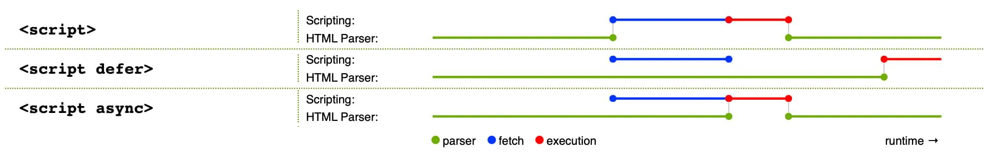

# JavaScript가 뭔가요?

## 그래서 어떤 일을 할 수 있나요?

클라이언트 사이드 JavaScript 언어의 핵심은 다음과 같은 일을 가능하게 해주는 프로그래밍 기능들로 구성됩니다.

* 변수에 값을 저장할 수 있습니다. 바로 위의 예제를 보면, 요청해서 받은 새로운 이름을 name이라는 변수에 저장합니다.
* 프로그래밍에서 "문자열"(string)이라고 부르는, 텍스트 조각을 조작합니다. 위 예제에서는 문자열 "플레이어 1: "과 name 변수의 값을 합쳐 온전한 텍스트 레이블("Player 1: Chris")을 생성합니다.
* 웹 페이지에서 발생하는 어떤 이벤트에 코드가 응답하도록 합니다. 예제에서는 click 이벤트를 사용해서 레이블을 클릭하는 순간을 탐지하고, 그 후에 텍스트 레이블을 업데이트하고 있습니다.
* 그밖에 더 많은 것들!

**애플리케이션 프로그래밍 인터페이스(API)**라고 부르는 이 기능들은 여러분의 JavaScript 코드에서 사용할 수 있는 강력한 마법을 추가로 제공합니다.

API는 개발자가 직접 구현하기는 어렵거나 불가능한 기능들을 미리 만들어서 제공하는 것입니다. 가구 DIY 키트 같은 거죠. 미리 재단된 판과 나사로 책장을 조립하는 게, 디자인하고 적합한 목재를 찾아서 올바른 크기와 모양으로 자른 후 적합한 크기의 나사를 찾아서 마침내 책장으로 만드는 것보다 훨씬 쉬운 법입니다.

API는 일반적으로 두 개의 범주로 분류할 수 있습니다.

**브라우저 API**는 웹 브라우저에 내장된 API로, 현재 컴퓨터 환경에 관한 데이터를 제공하거나 여러가지 유용하고 복잡한 일을 수행합니다.

* DOM (Document Object Model) API로 HTML 콘텐츠를 추가, 제거, 변경하고, 동적으로 페이지에 스타일을 추가하는 등 HTML/CSS를 조작할 수 있습니다. 페이지 위에 뜨는 팝업창이나, (위쪽의 간단한 예제처럼) 새로운 콘텐츠가 나타나는 것을 본 적이 있으면 DOM이 동작한 겁니다.
* Geolocation API로 지리정보를 가져올 수 있습니다. Google 지도에서 여러분의 위치를 찾아 지도에 그릴 수 있는 이유가 바로 이 API입니다.
* Canvas와 WebGL API로 애니메이션을 적용한 2D와 3D 그래픽을 만들 수 있습니다. 두 웹 기술을 사용해서 만들 수 있는 놀라운 결과를 엿보려면 Chrome Experiments와 webglsamples를 방문하세요.
* HTMLMediaElement와 WebRTC를 포함하는 오디오와 비디오 API로는 멀티미디어를 사용한 흥미로운 일을 할 수 있습니다. 예를 들어 오디오나 비디오를 웹 페이지에서 바로 재생하거나, 여러분의 웹캠으로 비디오를 찍어 다른 사람의 화면에 보여줄 수 있습니다. (간단한 스냅샷 데모를 방문해서 감을 잡아보세요)

```md
참고: 구형 브라우저에서는 위 예제 중 많은 수가 동작하지 않습니다. 웹 기술을 시험할 땐 Firefox, Chrome, Edge, Safari처럼 모던 브라우저를 사용하는 편이 좋습니다. 이후에 프로덕션 코드 (고객이 사용하게 될 코드) 배포에 다가가게 되면 크로스 브라우저 테스트 (en-US)를 고려하세요.
```

**서드파티 API**는 브라우저에 탑재되지 않은 API로, 웹의 어딘가에서 직접 코드와 정보를 찾아야 합니다.

* Twitter API로 여러분의 최신 트윗을 웹 사이트가 보여주도록 구현할 수 있습니다.
* Google 지도 API와 OpenStreetMap API로 웹 사이트에 지도를 삽입하고, 지도 관련 기능을 추가할 수 있습니다.

```md
참고: 위의 서드파티 API는 고급 기능으로, 이 과정에서는 다루지 않습니다. 클라이언트 사이드 웹 API 과정에서 알아보세요.
```

## 웹 페이지에서 JavaScript는 어떤 일을 하나요?

이제부턴 코드를 살펴보면서, 페이지에서 JavaScript를 돌리면 어떤 일이 일어나는지도 알아보겠습니다.

브라우저가 웹 페이지를 불러오면 어떤 일이 발생하는지 간단하게 복습해봅시다(CSS 동작 방식에서 먼저 알아봤습니다). 웹 페이지를 브라우저로 불러오면, 브라우저는 여러분의 코드(HTML, CSS, JavaScript)를 실행 환경(브라우저 탭)에서 실행합니다. 원자재(코드)를 가져와서 상품(웹 페이지)을 생산하는 공장처럼 생각할 수 있습니다.

JavaScript는 DOM (Document Object Model) API를 통해 HTML과 CSS를 동적으로 수정, 사용자 인터페이스를 업데이트하는 일에 가장 많이 쓰입니다. 참고로 웹 문서(페이지)의 코드는 보통 문서 상에 나타나는 순서 그대로 불러와 실행합니다. 수정하려는 HTML과 CSS 코드보다 JavaScript를 먼저 불러와 실행해버리면 오류가 발생할 수 있습니다. 아래의 스크립트 로딩 전략에서 이 문제의 해결법을 알아보겠습니다.

### 브라우저 보안

각각의 브라우저 탭은 코드를 실행하기 위한 독립적인 그릇(기술 용어로 "실행 환경"이라고 부릅니다)입니다. 독립적이라는 것은 대부분의 탭이 서로에게서 완전히 분리되어 한 탭의 코드가 다른 탭의 코드, 또는 다른 사이트에 직접적인 영향을 줄 수 없다는 뜻입니다. 이건 중요한 보안 절차입니다. 만약 이런 제약이 없으면 해커들이 다른 웹 사이트에서 정보를 훔치는 것을 포함해 여러가지 나쁜 일을 하는 코드를 작성할 것입니다.

### JavaScript 실행 순서

브라우저가 JavaScript 블록을 마주치면, 일반적으로는 순서대로 위에서 아래로 실행합니다. 따라서 코드 배치 순서에도 주의를 기울여야 합니다. 예를 들기 위해 맨 위의 첫 예제 코드로 돌아가봅시다.

```js
const para = document.querySelector('p');

para.addEventListener('click', updateName);

function updateName() {
  const name = prompt('Enter a new name');
  para.textContent = `Player 1: ${name}`;
}
```

위 코드는 텍스트 문단을 선택(1번 줄)해서 이벤트 수신기를 부착(3번 줄)하여, 사용자가 문단을 클릭하면 updateName() 코드 블록(5번 ~ 8번 줄)을 실행하도록 합니다. updateName() 코드 블록(이렇게 재사용 가능하도록 나눠놓은 코드 블록을 "함수"라고 합니다)은 사용자에게 새로운 이름을 물어보고, 그 이름을 문단에 삽입해서 화면을 업데이트합니다.

만약 1번 줄의 코드와 3번 줄의 코드 순서를 서로 바꿔서 실행했으면 원하는 동작 대신 브라우저 개발자 콘솔 (en-US)에 오류, `TypeError: para is undefined`가 나타나며, para 객체가 아직 존재하지 않으므로 이벤트 수신기를 부착할 수도 없다는 뜻입니다.

### 인터프리터와 컴파일러

프로그래밍에서의 **인터프리터**와 **컴파일러**라는 단어를 들어본 적이 있는지 생각해보세요. 인터프리터를 사용하는 언어에서는 코드를 위에서 아래로 실행하고, 코드 구동 결과는 즉시 반환됩니다. 브라우저에서 JavaScript 코드를 실행하기 전에 다른 형태로 변환할 필요가 없다는 점을 기억하세요. 코드는 프로그래머가 읽을 수 있는 형태로 입력되고, 별도의 처리 없이 그대로 실행됩니다.

반면, 컴파일러를 사용하는 컴파일 언어에서는 컴퓨터가 코드를 실행하기 전에 다른 형태로 변환(컴파일)해야 합니다. 예를 들어, C/C++에서는 코드를 컴파일러로 기계언어로 변환하여, 그 결과를 컴퓨터가 실행합니다. 프로그램은 프로그램의 원본 소스 코드에서 생성한 이진 형식(바이너리)으로부터 실행됩니다.

JavaScript는 가볍고, 인터프리터를 사용하는 프로그래밍 언어입니다. 웹 브라우저는 JavaScript 코드를 원문 텍스트 형식으로 입력받아 실행합니다. 기술적인 측면으로 따지자면, 대부분의 모던 JavaScript 인터프리터들은 사실 **JIT 컴파일**(just-in-time 컴파일)이라는 기술을 사용해 성능을 향상하기는 합니다. 스크립트의 실행과 동시에 소스 코드를 더 빠르게 실행할 수 있는 이진 형태로 변환하여 최대한 높은 실행 속도를 얻는 방법입니다. 하지만 JavaScript는 여전히 인터프리터 언어로 분류됩니다. 컴파일을 먼저 해놔야 하는 것이 아니라 런타임에 일어나기 때문입니다.

### 서버 사이드와 클라이언트 사이드 코드

웹 개발에 관련한 또 다른 용어로 **서버 사이드 코드**와 **클라이언트 사이드 코드**를 들어봤나요? 클라이언트 사이드 코드는 사용자의 컴퓨터에서 동작하는 코드입니다. 웹 페이지를 방문하면 브라우저가 페이지 내의 클라이언트 사이드 코드를 다운로드하고 실행해서 화면에 띄웁니다. 바로 이 과정에서 다루는 것은, 정확히는 **클라이언트 사이드 JavaScript**입니다.

반대로 서버 사이드 코드는 서버에서 동작하는 코드로, 그 실행 결과를 브라우저가 다운로드해서 화면에 띄우게 됩니다. 유명한 서버 사이드 웹 언어로는 PHP, Python, Ruby, ASP.NET, 그리고... **JavaScript**가 있습니다! JavaScript는 브라우저 뿐만 아니라, 많은 사람들이 사용하는 Node.js 환경처럼 서버 사이드 언어로도 사용할 수 있습니다. 서버 사이드 JavaScript에 관해서는 [동적 웹 사이트 – 서버 사이드 프로그래밍](https://developer.mozilla.org/ko/docs/Learn/Server-side) 과정에서 더 알아보세요.

### 동적 코드와 정적 코드

클라이언트 사이드 JavaScript와 서버 사이드 언어들 모두 동적이라는 단어로 설명할 수 있습니다. 동적인 이유는 웹 페이지/웹 앱의 서로 다른 상황에 서로 다른 화면을 보여줄 수 있고, 필요하면 새로운 콘텐츠를 생성할 수 있기 때문입니다. 서버 사이드 코드는 서버에서 새로운 콘텐츠를 생성 — 데이터베이스에서 데이터를 가져오는 등 — 합니다. 클라이언트 사이드 JavaScript는 클라이언트의 브라우저 내에서 새로운 콘텐츠를 생성 — 새로운 HTML 표를 생성하고, 서버에서 받아온 데이터로 채운 후, 사용자가 보고 있는 웹 페이지에 표시 — 합니다. 두 맥락 내에서 '동적'이라는 단어의 정확한 뜻은 약간 다르지만, 그럼에도 서로 연관되어 있으며, 두 방법(서버와 클라이언트 사이드)을 보통 함께 사용합니다.

동적으로 바뀌는 내용을 포함하지 않는 웹 페이지를 정적인 페이지라고 합니다. 정적인 페이지는 항상 같은 콘텐츠만 보여줍니다.

## 웹 페이지에 JavaScript를 어떻게 넣나요?

CSS와 비슷한 방법으로 JavaScript를 HTML 코드에 적용할 수 있습니다. CSS가 `<link>` 요소로 외부 스타일 시트를 적용하고, `<style>` 요소로 내부 스타일 시트를 적용했다면, JavaScript는 한 종류의 HTML 친구만 요구합니다. 바로 `<script>` 요소입니다. 어떻게 사용하는지 알아보겠습니다.

### 내부 JavaScript

```html
<script>

  // JavaScript goes here
document.addEventListener('DOMContentLoaded', () => {
  function createParagraph() {
    const para = document.createElement('p');
    para.textContent = 'You clicked the button!';
    document.body.appendChild(para);
  }

  const buttons = document.querySelectorAll('button');

  for (const button of buttons) {
    button.addEventListener('click', createParagraph);
  }
});
</script>
</head>
```

### 외부 JavaScript

```html
<script src="script.js" defer></script>
```

분명히 동작은 같지만, JavaScript 파일을 외부 파일로 분리할 수 있었습니다. 보통은, 코드도 정리하고 여러 HTML 파일에서 같은 코드를 재사용할 수 있도록, 스크립트를 외부 파일로 분리하는 것이 좋습니다.

### 인라인 JavaScript 처리기

```html
<button onclick="createParagraph()">Click me!</button>
```

**하지만, 이 방법을 사용하지 말아주세요.** JavaScript로 HTML 코드를 물들이는 것은 나쁜 방법일 뿐더러 비효율적입니다. JavaScript를 적용하려는 모든 버튼마다 일일히 `onclick="createParagraph()"`를 추가해야 하니까요.

### 대신 addEventListener 사용하기

`querySelectorAll()` 함수를 사용하면 현재 페이지 내의 모든 버튼을 선택할 수 있습니다. 그 후 반복과 `addEventListener()`로 버튼 하나씩 처리기를 부착하세요. 다음과 같은 모습이 될 것입니다.

```js
const buttons = document.querySelectorAll('button');

for (const button of buttons) {
  button.addEventListener('click', createParagraph);
}
```

### 스크립트 로딩 전략

**스크립트를 적절한 시점에 불러오는 일에는 몇 가지 문제가 있습니다.** 뭐든지 보이는 것만큼 간단하지는 않은 법이죠. 흔히 마주치게 되는 문제는, 페이지의 모든 HTML은 순서 그대로 불러온다는 점입니다. JavaScript를 사용해서 페이지 내의 요소 — 더 정확하게는 Document Object Model — 를 조작하려고 할 때, 해당 요소를 포함한 HTML 코드보다 JavaScript를 먼저 불러와버리면 코드가 올바르게 동작하지 못할 것입니다.

내부 예제에서는 코드 주위에 이런 구조를 볼 수 있습니다.

```js
document.addEventListener('DOMContentLoaded', () => {
  ...
});
```

이건 이벤트, 그중에서도 HTML 본문 전체를 불러와 읽었다는 것을 나타내는 브라우저 `DOMContentLoaded` 이벤트를 수신하는 수신기입니다. 이 블록 내부의 JavaScript는 이벤트가 발생하기 전에는 실행되지 않으므로 로딩 시점으로 인한 오류를 예방할 수 있습니다. (이후 과정에서 이벤트에 대해 알아보겠습니다)

외부 예제에서는 더 최신 기법을 사용해 문제 발생을 억제합니다. `defer` 특성은 브라우저가 `<script>` 태그를 마주쳐도 그 이후의 HTML 콘텐츠를 계속 불러오도록 지정합니다. defer는 외부 스크립트에만 사용할 수 있기 때문입니다.

```html
<script src="script.js" defer></script>
```

### async와 defer

`async` 특성을 지정하면 스크립트를 가져오는 동안 페이지 로딩을 중단하지 않습니다. 그러나 스크립트 다운로드가 끝나면 바로 실행되는데, 실행 도중에는 페이지 렌더링이 중단됩니다. 스크립트의 실행 순서를 보장할 방법은 없습니다. 따라서`async`는 다른 스크립트에 의존하지 않는 독립 스크립트에 사용해야 합니다.

`defer` 특성을 지정한 스크립트는 페이지 내에 배치한 순서대로 불러오게 됩니다. 또한 페이지 콘텐츠를 모두 불러오기 전까지는 실행하지 않으므로, 페이지 요소를 수정하거나 추가하는 등 DOM 작업을 기대하는 스크립트에 유용합니다.



예를 들어, 아래와 같이 세 개의 스크립트 요소를 가지고 있다고 가정해 보겠습니다.

```html
<script async src="js/vendor/jquery.js"></script>

<script async src="js/script2.js"></script>

<script async src="js/script3.js"></script>
```

위 코드로는 스크립트가 HTML의 순서대로 불러와질 것이라고 확실하게 예측할 수 없습니다. `jquery.js`를 `script2.js`와 `script3.js`보다 먼저 불러올 수도 있지만 이후에 불러올 수도 있습니다. 후자의 경우, `script2.js`와 `script3.js`에서 `jquery`에 의존하는 스크립트에서는 오류가 발생할 것입니다. `jquery`가 아직 정의되지 않았으니까요.

`async`는 다수의 백그라운드 스크립트를 최대한 빠르게 불러와야 할 때 사용하세요. 예를 들면 웹 게임을 시작했을 때 사용할 게임 데이터는 곧 필요하긴 하지만 지금 당장 필요한 것은 아니므로, 게임 데이터를 불러온다고 인트로 화면과 타이틀, 메인 메뉴 표시를 중단하지 않을 수 있습니다.

`defer` 특성으로 가져오는 스크립트(아래)는 페이지에 나타난 순서 그대로 불러와서, 페이지 콘텐츠와 위쪽 스크립트 로딩이 끝나면 실행합니다.

```html
<script defer src="js/vendor/jquery.js"></script>

<script defer src="js/script2.js"></script>

<script defer src="js/script3.js"></script>
```

위 코드에서는 `script2.js`와 `script3.js`보다 `jquery.js`를 먼저 불러올 것이라고 확신할 수 있습니다. 세 스크립트 모두 페이지 콘텐츠를 모두 불러오기 전엔 실행하지 않으므로, 페이지 요소를 수정해야 하는 등 DOM 조작이 필요하다면 더 유용합니다.

요약하자면,

* `async`와 `defer` 모두, 브라우저가 페이지의 다른 내용(DOM 등등)을 불러오는 동안 스크립트를 별도 스레드에서 불러오게 만듭니다. 덕분에 스크립트를 가져오는 동안 페이지 로딩이 중단되지 않습니다.
* `async` 특성을 지정한 스크립트는 다운로드가 끝나는 즉시 실행합니다. 실행은 현재 페이지 렌더링을 중단하며, 실행 순서는 보장되지 않습니다.
* `defer` 특성을 지정한 스크립트는 순서를 유지한 채로 가져오며 모든 콘텐츠를 다 불러온 이후에 실행합니다.
* 의존성 없는 스크립트를 불러온 즉시 실행하려면 `async`를 사용하세요.
* 다른 스크립트에 의존하거나 DOM 로딩이 필요한 스크립트에는 `defer`를 사용하고, 원하는 순서에 맞춰서 `<script>` 요소를 배치하세요.

## 주석

* 한 줄 짜리 주석은 맨 앞에 이중 빗금(//)으로 작성합니다.

```js
// 나, 주석
```

* 여러 줄 주석은 `/*`과 `*/`의 사이에 작성합니다.

```js
/*
  나 또한
  주석
*/
```